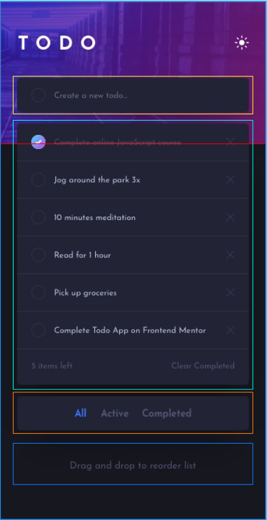
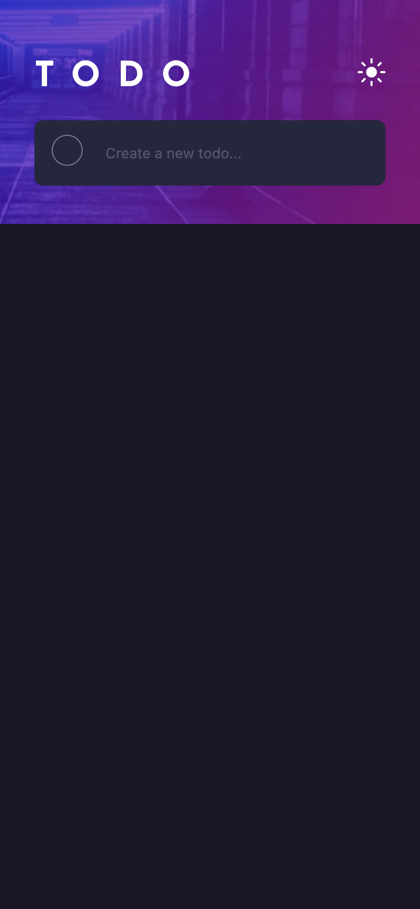
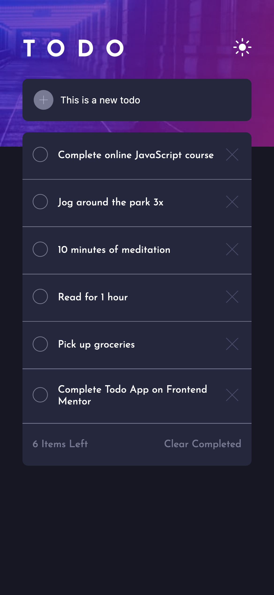

# Frontend Mentor - Todo app solution

This is a solution to the [Todo app challenge on Frontend Mentor](https://www.frontendmentor.io/challenges/todo-app-Su1_KokOW). Frontend Mentor challenges help you improve your coding skills by building realistic projects.

## Table of contents

- [Overview](#overview)
  - [The challenge](#the-challenge)
  - [Screenshot](#screenshot)
  - [Links](#links)
- [My process](#my-process)
  - [Built with](#built-with)
  - [What I learned](#what-i-learned)
  - [Continued development](#continued-development)
  - [Useful resources](#useful-resources)
- [Author](#author)
- [Acknowledgments](#acknowledgments)

## Overview

The objective of this challenge is to take images of a To-Do List App and create it in React. It needs to function as close as possible to what is displayed in the images.

### The challenge

Users should be able to:

- View the optimal layout for the app depending on their device's screen size
- See hover states for all interactive elements on the page
- Add new todos to the list
- Mark todos as complete
- Delete todos from the list
- Filter by all/active/complete todos
- Clear all completed todos
- Toggle light and dark mode
- **Bonus**: Drag and drop to reorder items on the list

### Screenshot


Add a screenshot of your solution. The easiest way to do this is to use Firefox to view your project, right-click the page and select "Take a Screenshot". You can choose either a full-height screenshot or a cropped one based on how long the page is. If it's very long, it might be best to crop it.

Alternatively, you can use a tool like [FireShot](https://getfireshot.com/) to take the screenshot. FireShot has a free option, so you don't need to purchase it.

Then crop/optimize/edit your image however you like, add it to your project, and update the file path in the image above.

**Note: Delete this note and the paragraphs above when you add your screenshot. If you prefer not to add a screenshot, feel free to remove this entire section.**

### Links

- Solution URL: [Add solution URL here](https://your-solution-url.com)
- Live Site URL: [Add live site URL here](https://your-live-site-url.com)

## My process

To start I pulled all of the JPEG files into Figma in order to lay them out where I could see them well. I typically use Figma to mark up the images and see exactly what components I need to build. It helps me visualize the app better and break it down into more bite sized chunks. I know I'm going to want to start mobile first so I place both of the mobile images at the front in order to make sure I foucus on those.



From what I can see it looks like we have a few components to focus on:

- Header (Red)
- Footer (Dark Blue)
- Add a To Do input (Yellow)
- Current To Do list (Seafoam)
- Filter List (Orange)

This makes everything seem much simpler to me and much more doable along with giving me a bit of structure for the project. So, let's get started with the dark mode version!

I'll go ahead and hop into the style-guide provided and pull the font and weights so we can get our app looking nice. After that I'll pull the background color and go ahead and style the container. I will be using Styled Components in this so the CSS will be contained in the components.

After I'm done with the basic styling I'll work on the header portion. This is just a basic layout to get us rolling so I'll get the background image placed where it needs to be, then get the H1 in and styled. Once both of those are done it's onto the sun SVG. SVG's are a bit tricky still so I played around with it a bit and got it to the correct size and place.

Now that the main portion of the header is placed (not yet functional) I'm working on getting the to-do input and button working. The main portion of this will be styling the checkbox. They are pretty unusual to style compared to other components, however there's usually a pretty quick work around that makes everything a lot easier. I'll look up what the most up to date way of styling the checkbox is and get that going. Once that's completed it's a matter of styling the text input and some padding for the whole component.

Once everything is completed with the to-do input box everything is at a good point to start breaking into smaller chunks so the code will be easier to read. After that, we move on to the list portion of the app where we will be adding in some functionality along with some basic data, but for the moment let's take a quick break and see where we are at.



Now that we have made the basic view of the components, let's move on to building out the list. This should be as simple as iterating over some data and putting it into the new Task component we made in order to build out a list of components. The only tricky thing I think will be handling the rounded edges but it should be a first-child and last-child style if I recall correctly.

Building out the list was pretty straight forward (at least currently, this may change if/when I add drag and drop functionality). It was pretty much what I expected, iterate over data and fill in the blanks. I did notice that the create todo and the marking off of a list item were very similar and it wasn't apparent where to tap/click to add a todo so I changed the look of the button on the input a little bit to make it obvious. Once that was done I did a little refactoring to get the data flowing better and to allow the list to be altered. Once that was completed we were getting very close to the finished overall look and the only thing left was some minor functionality pieces.



### Built with

- Semantic HTML5 markup
- CSS custom properties
- Flexbox
- CSS Grid
- Mobile-first workflow
- [React](https://reactjs.org/) - JS library
- [Next.js](https://nextjs.org/) - React framework
- [Styled Components](https://styled-components.com/) - For styles

**Note: These are just examples. Delete this note and replace the list above with your own choices**

### What I learned

Use this section to recap over some of your major learnings while working through this project. Writing these out and providing code samples of areas you want to highlight is a great way to reinforce your own knowledge.

To see how you can add code snippets, see below:

```html
<h1>Some HTML code I'm proud of</h1>
```

```css
.proud-of-this-css {
  color: papayawhip;
}
```

```js
const proudOfThisFunc = () => {
  console.log("🎉");
};
```

If you want more help with writing markdown, we'd recommend checking out [The Markdown Guide](https://www.markdownguide.org/) to learn more.

**Note: Delete this note and the content within this section and replace with your own learnings.**

### Continued development

Use this section to outline areas that you want to continue focusing on in future projects. These could be concepts you're still not completely comfortable with or techniques you found useful that you want to refine and perfect.

**Note: Delete this note and the content within this section and replace with your own plans for continued development.**

### Useful resources

- [Example resource 1](https://www.example.com) - This helped me for XYZ reason. I really liked this pattern and will use it going forward.
- [Example resource 2](https://www.example.com) - This is an amazing article which helped me finally understand XYZ. I'd recommend it to anyone still learning this concept.

**Note: Delete this note and replace the list above with resources that helped you during the challenge. These could come in handy for anyone viewing your solution or for yourself when you look back on this project in the future.**

## Author

- Website - [Matt Cowan](https://www.mattbcowan.com)
- Frontend Mentor - [@mattbcowan](https://www.frontendmentor.io/profile/mattbcowan)
- Twitter - [@mattbcowan](https://www.twitter.com/mattbcowan)

**Note: Delete this note and add/remove/edit lines above based on what links you'd like to share.**
